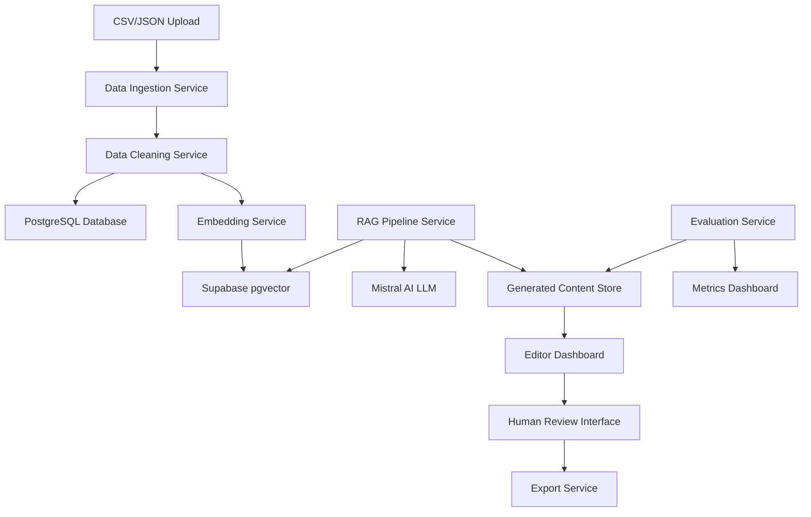

# Design Document

## Overview

The AutoDescribe RAG System is a microservices-based architecture that processes product data through a multi-stage pipeline: ingestion → cleaning → embedding → retrieval → generation → human review → export. The system leverages Mistral AI for both embeddings and text generation, Supabase for vector storage, PostgreSQL for structured data, and provides a web-based dashboard for human oversight.

## Architecture

### High-Level Architecture



### Service Architecture

The system follows a microservices pattern with the following core services:

1. **Data Ingestion Service**: Handles file uploads and initial parsing
2. **Data Cleaning Service**: Normalizes and standardizes product attributes
3. **Embedding Service**: Generates vector embeddings using Mistral AI
4. **RAG Pipeline Service**: Orchestrates retrieval and generation
5. **Editor Dashboard Service**: Provides web interface for human review
6. **Export Service**: Handles approved content export
7. **Evaluation Service**: Computes quality metrics and analytics

## Components and Interfaces

### Data Ingestion Component

**Purpose**: Parse and validate uploaded product data files

**Interfaces**:
- REST API endpoint: `POST /api/v1/upload`
- Input: Multipart form data (CSV/JSON files)
- Output: Validation report and ingestion job ID

**Key Functions**:
- File format detection and parsing
- Schema validation (required fields: sku, name)
- Error logging and reporting
- Batch processing for large files

### Data Cleaning Component

**Purpose**: Normalize and standardize product attributes

**Interfaces**:
- Internal service API: `POST /internal/clean`
- Input: Raw product data from ingestion
- Output: Cleaned, structured product records

**Key Functions**:
- Breadcrumb flattening to text format
- Attribute standardization (color, size, weight, dimensions)
- Miscellaneous attribute consolidation
- Data quality scoring

### Embedding Service

**Purpose**: Generate vector embeddings for product attributes

**Interfaces**:
- Internal API: `POST /internal/embed`
- Mistral AI API integration
- Input: Cleaned product text
- Output: Vector embeddings

**Key Functions**:
- Text preprocessing and chunking
- Batch embedding generation
- Vector storage in Supabase pgvector
- Embedding versioning and updates

### RAG Pipeline Service

**Purpose**: Orchestrate retrieval and content generation

**Interfaces**:
- REST API: `POST /api/v1/generate`
- Input: Product SKU or search criteria
- Output: Generated product copy

**Key Functions**:
- Similarity search in vector database
- Context retrieval and ranking
- Prompt template management
- LLM integration with Mistral AI
- Hallucination prevention checks

### Editor Dashboard Service

**Purpose**: Provide web interface for human review and editing

**Interfaces**:
- Web application (React/Next.js frontend)
- REST API: `/api/v1/dashboard/*`
- WebSocket for real-time updates

**Key Functions**:
- Side-by-side product spec and copy display
- In-line text editing capabilities
- Approval/rejection workflow
- Status tracking and logging

## Data Models

### Product Model

```typescript
interface Product {
  id: string;
  sku: string;
  name: string;
  brand?: string;
  breadcrumbs_text: string;
  attributes: {
    color?: string;
    size?: string;
    weight?: string;
    dimensions?: string;
  };
  additional_text: string;
  created_at: Date;
  updated_at: Date;
}
```

### Generated Content Model

```typescript
interface GeneratedContent {
  id: string;
  product_id: string;
  content_type: 'long_description' | 'bullet_points' | 'variant_copy';
  generated_text: string;
  edited_text?: string;
  status: 'pending' | 'approved' | 'rejected';
  seo_keywords: string[];
  quality_metrics: {
    attribute_coverage: number;
    readability_score: number;
    keyword_coverage: number;
  };
  editor_id?: string;
  reviewed_at?: Date;
  created_at: Date;
}
```

### Embedding Model

```typescript
interface ProductEmbedding {
  id: string;
  product_id: string;
  text_chunk: string;
  embedding: number[];
  chunk_type: 'name' | 'attributes' | 'description';
  created_at: Date;
}
```

### Review Session Model

```typescript
interface ReviewSession {
  id: string;
  editor_id: string;
  product_id: string;
  start_time: Date;
  end_time?: Date;
  actions: ReviewAction[];
  brand_voice_rating?: number;
}

interface ReviewAction {
  timestamp: Date;
  action_type: 'edit' | 'approve' | 'reject';
  content_id: string;
  changes?: string;
}
```

## Error Handling

### Data Ingestion Errors

- **File Format Errors**: Return 400 with specific format requirements
- **Schema Validation Errors**: Log missing fields, continue with valid records
- **Large File Handling**: Implement streaming and chunked processing
- **Duplicate SKU Handling**: Update existing records or create versions

### RAG Pipeline Errors

- **Embedding Service Failures**: Retry with exponential backoff, fallback to cached embeddings
- **LLM API Failures**: Implement circuit breaker pattern, queue requests for retry
- **Hallucination Detection**: Flag content with low attribute coverage for human review
- **Context Retrieval Failures**: Use fallback to basic product attributes

### Dashboard Errors

- **Concurrent Editing**: Implement optimistic locking with conflict resolution
- **Session Management**: Auto-save drafts, handle session timeouts
- **Export Failures**: Provide partial exports, retry mechanisms

## Testing Strategy

### Unit Testing

- **Data Cleaning Functions**: Test attribute normalization and validation
- **Embedding Generation**: Mock Mistral AI responses, test vector operations
- **Content Generation**: Test prompt templates and response parsing
- **Quality Metrics**: Test coverage calculations and readability scoring

### Integration Testing

- **End-to-End Pipeline**: Test complete flow from upload to export
- **Database Operations**: Test PostgreSQL and Supabase interactions
- **API Integration**: Test Mistral AI API calls and error handling
- **Dashboard Workflows**: Test user interactions and state management

### Performance Testing

- **Batch Processing**: Test large file ingestion and processing times
- **Vector Search**: Test retrieval performance with large embedding datasets
- **Concurrent Users**: Test dashboard performance under multiple editors
- **LLM Response Times**: Monitor and optimize generation latency

### Quality Assurance

- **Content Quality**: Automated checks for attribute coverage and readability
- **SEO Validation**: Verify keyword inclusion and optimization
- **Human Review Metrics**: Track approval rates and editing patterns
- **Brand Voice Consistency**: Implement scoring mechanisms for brand alignment