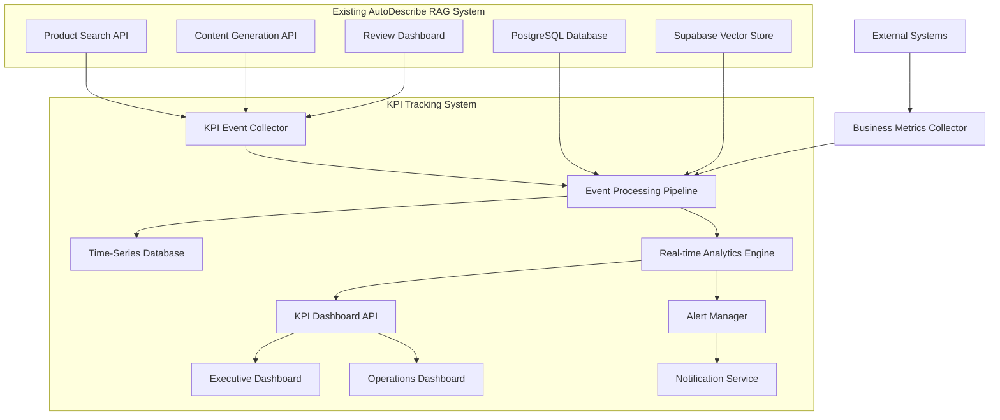

# KPI Tracking System Design Document

## Overview

The KPI Tracking System is a comprehensive analytics and monitoring layer that integrates with the existing AutoDescribe RAG System to provide real-time insights across three critical dimensions: Data & System Quality, User Experience, and Business Impact. The system uses event-driven architecture with time-series data storage, real-time dashboards, and automated alerting to enable data-driven optimization of the RAG system.

## Architecture

### High-Level Architecture



### Integration Architecture

The KPI system integrates with existing components through:

1. **Event Interception**: Middleware captures API calls and user interactions
2. **Database Triggers**: PostgreSQL triggers capture data changes
3. **Webhook Integration**: External systems push business metrics
4. **Batch Processing**: Periodic analysis of historical data

## Components and Interfaces

### KPI Event Collector

**Purpose**: Capture and standardize KPI events from all system touchpoints

**Interfaces**:
- Middleware integration with existing APIs
- WebSocket connections for real-time user interactions
- Database triggers for data quality monitoring
- REST API: `POST /api/kpi/events`

**Key Functions**:
- Event normalization and validation
- Session tracking and user journey mapping
- Asynchronous event queuing
- Data privacy compliance (PII anonymization)

```typescript
interface KPIEvent {
  id: string;
  type: 'search' | 'generation' | 'review' | 'data_quality' | 'system_performance';
  timestamp: Date;
  session_id: string;
  user_id?: string;
  metadata: Record<string, any>;
  source: 'api' | 'dashboard' | 'system' | 'external';
}
```

### Event Processing Pipeline

**Purpose**: Process, aggregate, and enrich KPI events for analysis

**Interfaces**:
- Message queue consumer (Redis/RabbitMQ)
- Database connections (PostgreSQL, InfluxDB)
- External API integrations

**Key Functions**:
- Real-time event stream processing
- Data aggregation and rollup calculations
- Anomaly detection and threshold monitoring
- Historical data backfill and reconciliation

**Processing Stages**:
1. **Ingestion**: Receive events from collectors
2. **Validation**: Schema validation and data quality checks
3. **Enrichment**: Add contextual data and calculated metrics
4. **Aggregation**: Create time-based rollups (minute, hour, day)
5. **Storage**: Persist to time-series and relational databases

### Real-time Analytics Engine

**Purpose**: Compute KPIs and detect patterns in real-time

**Interfaces**:
- Stream processing framework (Apache Kafka/Redis Streams)
- Machine learning pipeline integration
- Alert threshold configuration API

**Key Functions**:
- Sliding window calculations for real-time metrics
- Statistical analysis and trend detection
- Predictive analytics for proactive alerting
- A/B test analysis and statistical significance testing

### KPI Dashboard API

**Purpose**: Provide data access layer for dashboards and reporting

**Interfaces**:
- REST API: `/api/kpi/metrics/*`
- GraphQL endpoint for flexible queries
- WebSocket for real-time updates
- Export API for data downloads

**Key Endpoints**:
```typescript
// Data Quality KPIs
GET /api/kpi/data-quality/completeness
GET /api/kpi/data-quality/normalization
GET /api/kpi/retrieval/precision-recall

// User Experience KPIs
GET /api/kpi/search/success-rate
GET /api/kpi/user/engagement
GET /api/kpi/user/satisfaction

// Business Impact KPIs
GET /api/kpi/business/conversion-rate
GET /api/kpi/business/revenue-metrics
GET /api/kpi/business/customer-retention
```

### Alert Manager

**Purpose**: Monitor KPI thresholds and trigger notifications

**Interfaces**:
- Rule engine for threshold configuration
- Notification channels (email, Slack, webhooks)
- Escalation policy management

**Key Functions**:
- Multi-level threshold monitoring (warning, critical)
- Smart alerting with noise reduction
- Escalation workflows and on-call integration
- Alert correlation and root cause analysis

## Data Models

### KPI Metrics Schema

```typescript
// Time-series metrics table
interface KPIMetric {
  id: string;
  metric_name: string;
  metric_value: number;
  dimensions: Record<string, string>; // e.g., {product_category: "electronics"}
  timestamp: Date;
  aggregation_level: 'raw' | 'minute' | 'hour' | 'day' | 'week';
  created_at: Date;
}

// Data quality metrics
interface DataQualityMetric {
  id: string;
  total_products: number;
  complete_products: number;
  normalized_products: number;
  quality_score: number;
  completeness_by_field: Record<string, number>;
  timestamp: Date;
}

// Search quality metrics
interface SearchQualityMetric {
  id: string;
  query: string;
  results_count: number;
  precision_at_k: Record<number, number>; // {1: 0.8, 5: 0.6, 10: 0.4}
  recall_at_k: Record<number, number>;
  mrr: number;
  response_time_ms: number;
  session_id: string;
  timestamp: Date;
}

// User experience metrics
interface UserExperienceMetric {
  id: string;
  session_id: string;
  search_success_rate: number;
  time_to_first_click_ms: number;
  click_through_rate: number;
  query_refinement_count: number;
  satisfaction_score?: number;
  timestamp: Date;
}

// Business impact metrics
interface BusinessImpactMetric {
  id: string;
  session_id: string;
  conversion_rate: number;
  average_order_value: number;
  revenue_per_session: number;
  customer_lifetime_value?: number;
  timestamp: Date;
}
```

### Alert Configuration Schema

```typescript
interface AlertRule {
  id: string;
  name: string;
  metric_name: string;
  condition: 'greater_than' | 'less_than' | 'equals' | 'not_equals';
  threshold_value: number;
  severity: 'info' | 'warning' | 'critical';
  time_window_minutes: number;
  notification_channels: string[];
  is_active: boolean;
  created_at: Date;
}

interface AlertInstance {
  id: string;
  rule_id: string;
  triggered_at: Date;
  resolved_at?: Date;
  current_value: number;
  threshold_value: number;
  status: 'active' | 'resolved' | 'suppressed';
  notification_sent: boolean;
}
```

## Error Handling

### Event Collection Errors

- **High Volume Handling**: Implement backpressure and circuit breakers
- **Data Loss Prevention**: Use persistent queues with dead letter handling
- **Schema Evolution**: Support backward compatibility for event formats
- **Network Failures**: Implement retry logic with exponential backoff

### Processing Pipeline Errors

- **Stream Processing Failures**: Implement checkpointing and replay mechanisms
- **Database Connection Issues**: Use connection pooling and failover strategies
- **Calculation Errors**: Implement data validation and error logging
- **Memory Management**: Monitor and optimize for high-throughput processing

### Dashboard and API Errors

- **Query Performance**: Implement caching and query optimization
- **Real-time Update Failures**: Graceful degradation to polling
- **Data Consistency**: Handle eventual consistency in distributed systems
- **Rate Limiting**: Protect APIs from abuse and overload

## Testing Strategy

### Unit Testing

**Data Quality Calculations**:
- Test completeness percentage calculations
- Validate normalization scoring algorithms
- Test precision/recall metric computations
- Verify MRR calculation accuracy

**Event Processing**:
- Test event validation and normalization
- Validate aggregation logic for time windows
- Test anomaly detection algorithms
- Verify alert threshold evaluations

**API Endpoints**:
- Test metric retrieval with various filters
- Validate real-time data streaming
- Test export functionality and formats
- Verify authentication and authorization

### Integration Testing

**End-to-End KPI Flow**:
- Test complete pipeline from event to dashboard
- Validate cross-system data consistency
- Test real-time vs batch processing alignment
- Verify alert delivery and escalation

**Database Integration**:
- Test time-series data ingestion performance
- Validate query performance under load
- Test data retention and archival processes
- Verify backup and recovery procedures

**External System Integration**:
- Test business metrics collection from external sources
- Validate webhook reliability and error handling
- Test API rate limiting and throttling
- Verify data format compatibility

### Performance Testing

**High-Volume Event Processing**:
- Test throughput limits for event ingestion
- Validate processing latency under load
- Test memory usage and garbage collection
- Verify horizontal scaling capabilities

**Dashboard Performance**:
- Test query response times with large datasets
- Validate real-time update performance
- Test concurrent user load handling
- Verify caching effectiveness

**Alert System Performance**:
- Test alert processing latency
- Validate notification delivery reliability
- Test escalation timing accuracy
- Verify alert storm handling

### Quality Assurance

**Data Accuracy**:
- Validate KPI calculations against known datasets
- Test edge cases and boundary conditions
- Verify data consistency across time zones
- Test historical data migration accuracy

**User Experience**:
- Test dashboard usability and responsiveness
- Validate alert notification clarity
- Test mobile and cross-browser compatibility
- Verify accessibility compliance

**Security and Privacy**:
- Test PII anonymization effectiveness
- Validate access control and permissions
- Test data encryption in transit and at rest
- Verify audit logging completeness

## Scalability and Performance

### Horizontal Scaling

- **Event Collectors**: Stateless design for easy horizontal scaling
- **Processing Pipeline**: Partitioned stream processing for parallel execution
- **Database Layer**: Sharding strategies for time-series data
- **API Layer**: Load balancing and caching for high availability

### Performance Optimization

- **Data Compression**: Efficient storage formats for time-series data
- **Query Optimization**: Materialized views and pre-aggregated metrics
- **Caching Strategy**: Multi-level caching (Redis, CDN, application-level)
- **Resource Management**: Auto-scaling based on load patterns

### Monitoring and Observability

- **System Metrics**: Monitor KPI system performance itself
- **Distributed Tracing**: Track requests across microservices
- **Log Aggregation**: Centralized logging for debugging and analysis
- **Health Checks**: Comprehensive health monitoring for all components