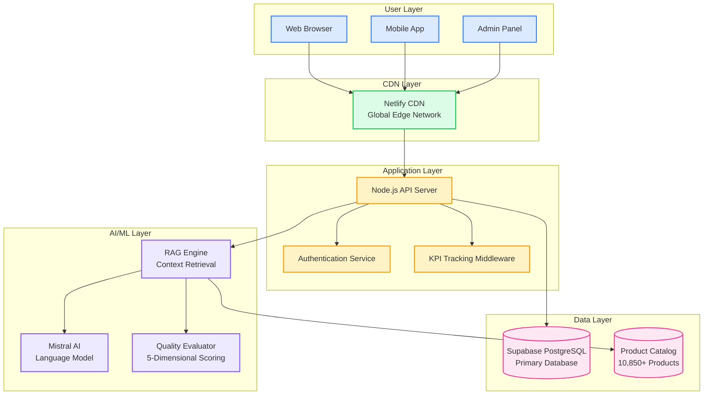

# AutoDescribe Architecture - Image Generation Prompts

## Image Generation Prompts for AI Tools (DALL-E, Midjourney, etc.)

### 1. High-Level System Architecture Diagram

**Prompt for AI Image Generator:**
```
Create a professional system architecture diagram for an AI-powered e-commerce platform called "AutoDescribe". The diagram should show:

- Top layer: Web browsers and mobile devices (users)
- CDN layer: Global content delivery network with edge nodes
- Application layer: Node.js backend services with load balancers
- AI/ML layer: Mistral AI integration with RAG (Retrieval-Augmented Generation) engine
- Database layer: PostgreSQL database with product catalog
- Analytics layer: Real-time KPI dashboards and monitoring

Use modern, clean design with:
- Blue and white color scheme
- Professional tech company style
- Clear arrows showing data flow
- Rounded rectangles for components
- Icons for different services (cloud, database, AI brain, analytics charts)
- Clean typography and proper spacing

Style: Modern tech architecture diagram, professional presentation quality, clean and minimalist
```

### 2. AI/ML Pipeline Visualization

**Prompt for AI Image Generator:**
```
Create a detailed AI/ML pipeline diagram showing the AutoDescribe content generation process:

Flow from left to right:
1. Product SKU input (shopping cart icon)
2. RAG Context Retrieval (search/database icons)
3. Mistral AI Processing (brain/AI chip icon)
4. Quality Evaluation (5-star rating system)
5. Content Output (document/text icon)

Include:
- Modern gradient backgrounds (blue to purple)
- Flowing arrows between stages
- Icons representing each step
- Data visualization elements
- Professional tech aesthetic
- Clean, modern typography

Style: Futuristic AI/ML pipeline, gradient colors, professional tech presentation
```

### 3. Data Flow Architecture

**Prompt for AI Image Generator:**
```
Create a circular data flow diagram for AutoDescribe platform showing:

Center: AutoDescribe logo/platform core
Surrounding elements connected with curved arrows:
- User Interface (laptop/mobile icons)
- AI Engine (brain/processor icon)
- Product Database (cylinder/database icon)
- Analytics Dashboard (chart/graph icons)
- Quality Assurance (checkmark/shield icon)
- Content Repository (folder/document icons)

Use:
- Circular/radial layout
- Smooth curved connecting lines
- Modern flat design icons
- Blue, green, and purple color palette
- Professional business presentation style
- Clean white background

Style: Modern circular data flow diagram, business presentation quality, flat design icons
```

### 4. Security Architecture Layers

**Prompt for AI Image Generator:**
```
Create a layered security architecture diagram showing 7 security layers stacked vertically:

From top to bottom:
1. Application Security (shield icon)
2. Authentication & Authorization (key/lock icons)
3. API Security (gateway icon)
4. Transport Security (HTTPS/SSL icons)
5. Network Security (firewall icon)
6. Data Security (encryption icon)
7. Infrastructure Security (server/cloud icons)

Design elements:
- Stacked horizontal layers with slight 3D effect
- Security-themed color scheme (blues, greens, with accent colors)
- Professional cybersecurity aesthetic
- Icons representing each security layer
- Clean, enterprise-grade presentation style

Style: Professional cybersecurity diagram, layered architecture, enterprise presentation quality
```

### 5. Component Interaction Map

**Prompt for AI Image Generator:**
```
Create a network-style component interaction diagram showing:

Main components as nodes:
- Frontend (React/Next.js)
- Backend API (Node.js)
- AI Service (Mistral)
- Database (PostgreSQL)
- Analytics Engine
- Quality Evaluator
- RAG System

Connected with lines showing relationships and data flow
Include:
- Network topology style layout
- Modern tech icons for each component
- Color-coded connections (data flow, API calls, etc.)
- Professional software architecture aesthetic
- Clean, technical diagram style
- Blue and gray color scheme

Style: Software architecture network diagram, technical documentation quality, modern and clean
```

## SVG Code Templates for Direct Use

### Simple Architecture Overview SVG

```svg
<svg width="800" height="600" xmlns="http://www.w3.org/2000/svg">
  <!-- Background -->
  <rect width="800" height="600" fill="#f8fafc"/>
  
  <!-- Title -->
  <text x="400" y="30" text-anchor="middle" font-family="Arial, sans-serif" font-size="24" font-weight="bold" fill="#1e293b">AutoDescribe System Architecture</text>
  
  <!-- User Layer -->
  <rect x="50" y="60" width="700" height="80" rx="10" fill="#dbeafe" stroke="#3b82f6" stroke-width="2"/>
  <text x="400" y="85" text-anchor="middle" font-family="Arial, sans-serif" font-size="14" font-weight="bold" fill="#1e40af">User Interface Layer</text>
  <text x="400" y="105" text-anchor="middle" font-family="Arial, sans-serif" font-size="12" fill="#1e40af">Web Application (Next.js) • Mobile App • Admin Panel</text>
  
  <!-- CDN Layer -->
  <rect x="50" y="160" width="700" height="80" rx="10" fill="#dcfce7" stroke="#22c55e" stroke-width="2"/>
  <text x="400" y="185" text-anchor="middle" font-family="Arial, sans-serif" font-size="14" font-weight="bold" fill="#15803d">Content Delivery Network</text>
  <text x="400" y="205" text-anchor="middle" font-family="Arial, sans-serif" font-size="12" fill="#15803d">Netlify CDN • Global Edge Network • Load Balancing</text>
  
  <!-- Application Layer -->
  <rect x="50" y="260" width="700" height="80" rx="10" fill="#fef3c7" stroke="#f59e0b" stroke-width="2"/>
  <text x="400" y="285" text-anchor="middle" font-family="Arial, sans-serif" font-size="14" font-weight="bold" fill="#92400e">Application Services</text>
  <text x="400" y="305" text-anchor="middle" font-family="Arial, sans-serif" font-size="12" fill="#92400e">Node.js API • Express Server • Authentication • KPI Tracking</text>
  
  <!-- AI/ML Layer -->
  <rect x="50" y="360" width="700" height="80" rx="10" fill="#ede9fe" stroke="#8b5cf6" stroke-width="2"/>
  <text x="400" y="385" text-anchor="middle" font-family="Arial, sans-serif" font-size="14" font-weight="bold" fill="#6d28d9">AI/ML Pipeline</text>
  <text x="400" y="405" text-anchor="middle" font-family="Arial, sans-serif" font-size="12" fill="#6d28d9">Mistral AI • RAG Engine • Quality Evaluator • Embeddings</text>
  
  <!-- Data Layer -->
  <rect x="50" y="460" width="700" height="80" rx="10" fill="#fce7f3" stroke="#ec4899" stroke-width="2"/>
  <text x="400" y="485" text-anchor="middle" font-family="Arial, sans-serif" font-size="14" font-weight="bold" fill="#be185d">Data Storage</text>
  <text x="400" y="505" text-anchor="middle" font-family="Arial, sans-serif" font-size="12" fill="#be185d">Supabase PostgreSQL • Product Catalog • Analytics Data</text>
  
  <!-- Arrows -->
  <defs>
    <marker id="arrowhead" markerWidth="10" markerHeight="7" refX="9" refY="3.5" orient="auto">
      <polygon points="0 0, 10 3.5, 0 7" fill="#64748b"/>
    </marker>
  </defs>
  
  <line x1="400" y1="140" x2="400" y2="160" stroke="#64748b" stroke-width="2" marker-end="url(#arrowhead)"/>
  <line x1="400" y1="240" x2="400" y2="260" stroke="#64748b" stroke-width="2" marker-end="url(#arrowhead)"/>
  <line x1="400" y1="340" x2="400" y2="360" stroke="#64748b" stroke-width="2" marker-end="url(#arrowhead)"/>
  <line x1="400" y1="440" x2="400" y2="460" stroke="#64748b" stroke-width="2" marker-end="url(#arrowhead)"/>
</svg>
```

## Mermaid Diagram for Online Rendering

You can use this Mermaid code in online tools like mermaid.live or GitHub:



## Tools for Creating Architecture Images

### 1. Online Diagram Tools
- **Draw.io (diagrams.net)**: Free, professional diagrams
- **Lucidchart**: Professional architecture diagrams
- **Miro**: Collaborative diagramming
- **Figma**: Design-focused architecture diagrams

### 2. AI Image Generators
- **DALL-E 3**: Use the prompts above
- **Midjourney**: Professional diagram generation
- **Stable Diffusion**: Open-source image generation
- **Adobe Firefly**: Creative architecture diagrams

### 3. Code-Based Diagrams
- **Mermaid**: GitHub-integrated diagrams
- **PlantUML**: Text-to-diagram conversion
- **D3.js**: Custom interactive diagrams
- **Graphviz**: Programmatic graph generation

## Recommended Approach

1. **Use the SVG template** above for a quick, clean diagram
2. **Copy the Mermaid code** into mermaid.live for instant rendering
3. **Use the AI prompts** with DALL-E or Midjourney for professional images
4. **Import into Draw.io** for further customization

Each approach will give you a professional architecture diagram suitable for presentations, documentation, or stakeholder meetings!