# AutoDescribe System Architecture

## High-Level Architecture Diagram

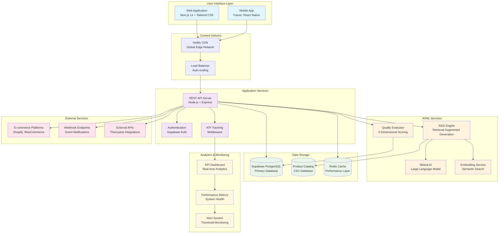

## Detailed Component Architecture

### Frontend Architecture (Next.js 14)

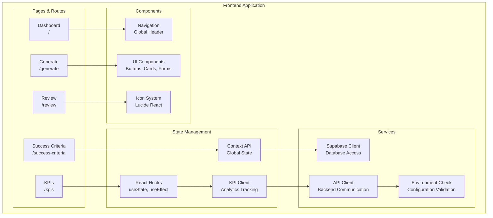

### Backend Architecture (Node.js/Express)

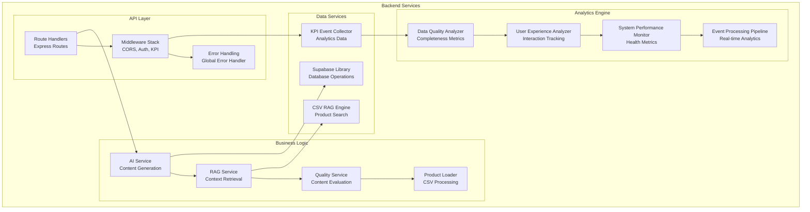

### Database Schema Architecture

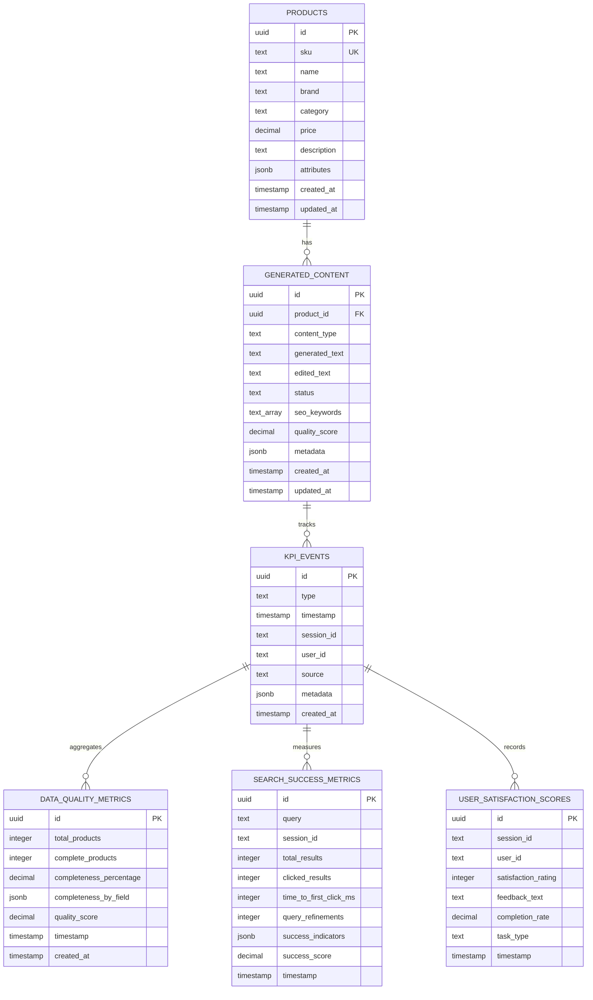

### AI/ML Pipeline Architecture

```mermaid
graph LR
    subgraph "Input Processing"
        SKU[Product SKU<br/>Input]
        SEARCH[Search Query<br/>User Input]
    end
    
    subgraph "RAG Pipeline"
        RETRIEVAL[Product Retrieval<br/>CSV Database Search]
        CONTEXT[Context Building<br/>Similar Products]
        EMBEDDING[Semantic Embedding<br/>Mistral Embeddings]
    end
    
    subgraph "AI Generation"
        PROMPT[Prompt Engineering<br/>Context + Instructions]
        MISTRAL_API[Mistral AI API<br/>mistral-large-latest]
        RESPONSE[Generated Content<br/>Raw Output]
    end
    
    subgraph "Quality Assurance"
        EVALUATION[Quality Evaluation<br/>5-Dimensional Scoring]
        SCORING[Score Calculation<br/>Technical, SEO, Brand, etc.]
        FEEDBACK[Quality Feedback<br/>Recommendations]
    end
    
    subgraph "Output Processing"
        STORAGE[Content Storage<br/>Database Persistence]
        REVIEW[Review Queue<br/>Human Approval]
        PUBLISH[Content Publishing<br/>Final Output]
    end

    SKU --> RETRIEVAL
    SEARCH --> RETRIEVAL
    RETRIEVAL --> CONTEXT
    CONTEXT --> EMBEDDING
    EMBEDDING --> PROMPT
    
    PROMPT --> MISTRAL_API
    MISTRAL_API --> RESPONSE
    RESPONSE --> EVALUATION
    
    EVALUATION --> SCORING
    SCORING --> FEEDBACK
    FEEDBACK --> STORAGE
    
    STORAGE --> REVIEW
    REVIEW --> PUBLISH
```

### KPI Tracking & Analytics Architecture

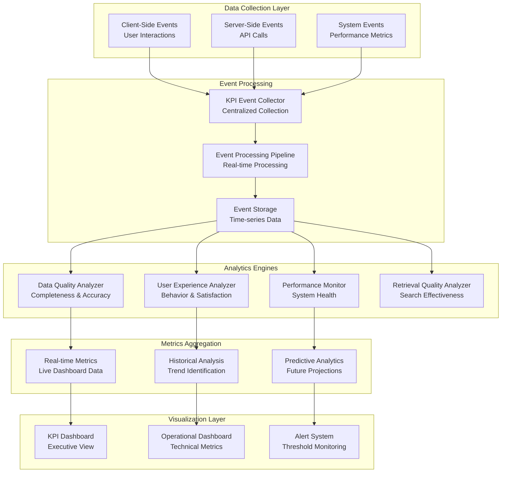

## Deployment Architecture

### Production Environment

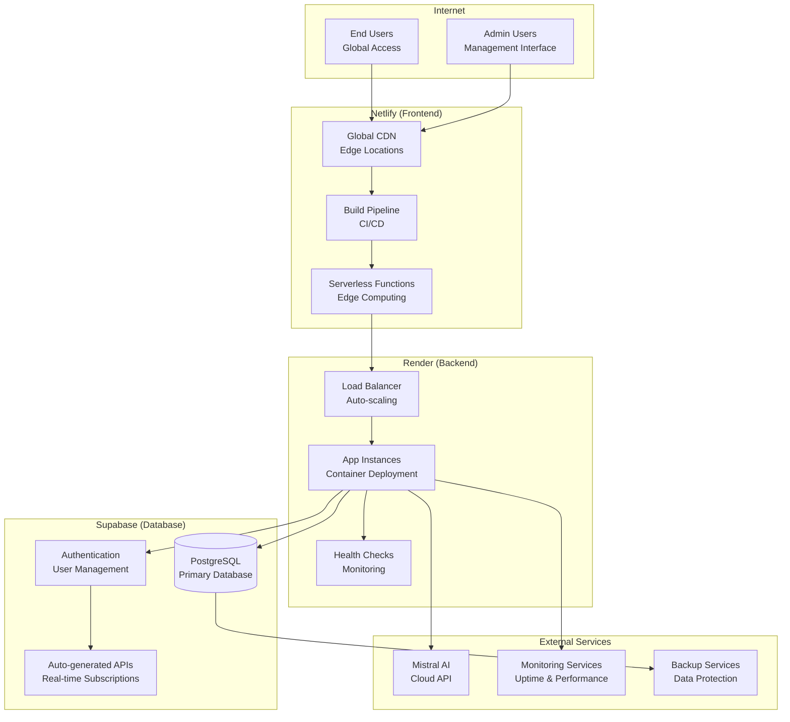

### Development Environment

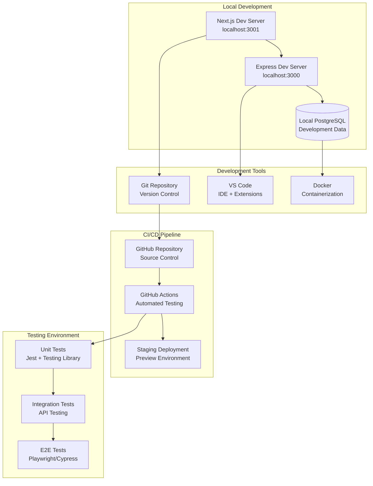

## Security Architecture

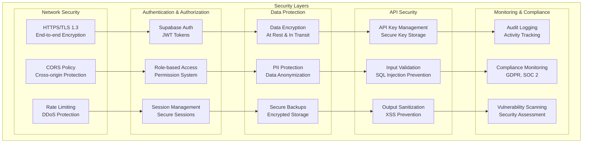

## Performance & Scalability

### Caching Strategy

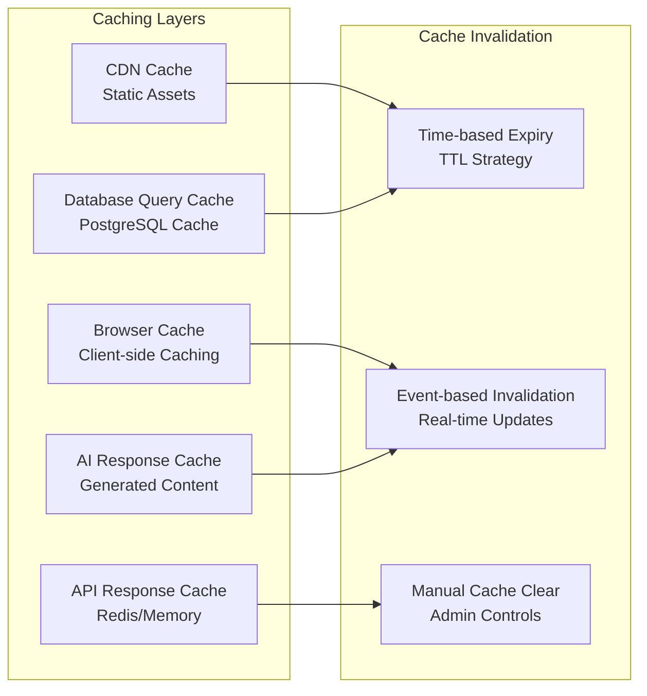

### Auto-scaling Configuration

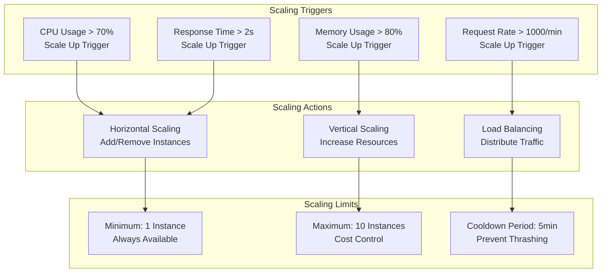

## Technology Stack Summary

### Frontend Stack
- **Framework**: Next.js 14 (React 18)
- **Styling**: Tailwind CSS
- **Icons**: Lucide React
- **State Management**: React Hooks + Context API
- **Build Tool**: Webpack (Next.js built-in)
- **Deployment**: Netlify

### Backend Stack
- **Runtime**: Node.js 18+
- **Framework**: Express.js
- **Language**: TypeScript
- **Database**: PostgreSQL (Supabase)
- **AI/ML**: Mistral AI API
- **Caching**: Redis (future)
- **Deployment**: Render

### DevOps & Infrastructure
- **Version Control**: Git + GitHub
- **CI/CD**: GitHub Actions
- **Monitoring**: Built-in analytics + external monitoring
- **Security**: HTTPS, CORS, Rate limiting
- **Backup**: Automated database backups

### External Services
- **AI Provider**: Mistral AI
- **Database**: Supabase (PostgreSQL + Auth)
- **CDN**: Netlify Edge Network
- **Hosting**: Render (Backend) + Netlify (Frontend)

This architecture provides a robust, scalable, and maintainable foundation for the AutoDescribe platform, supporting current needs while enabling future growth and feature expansion.